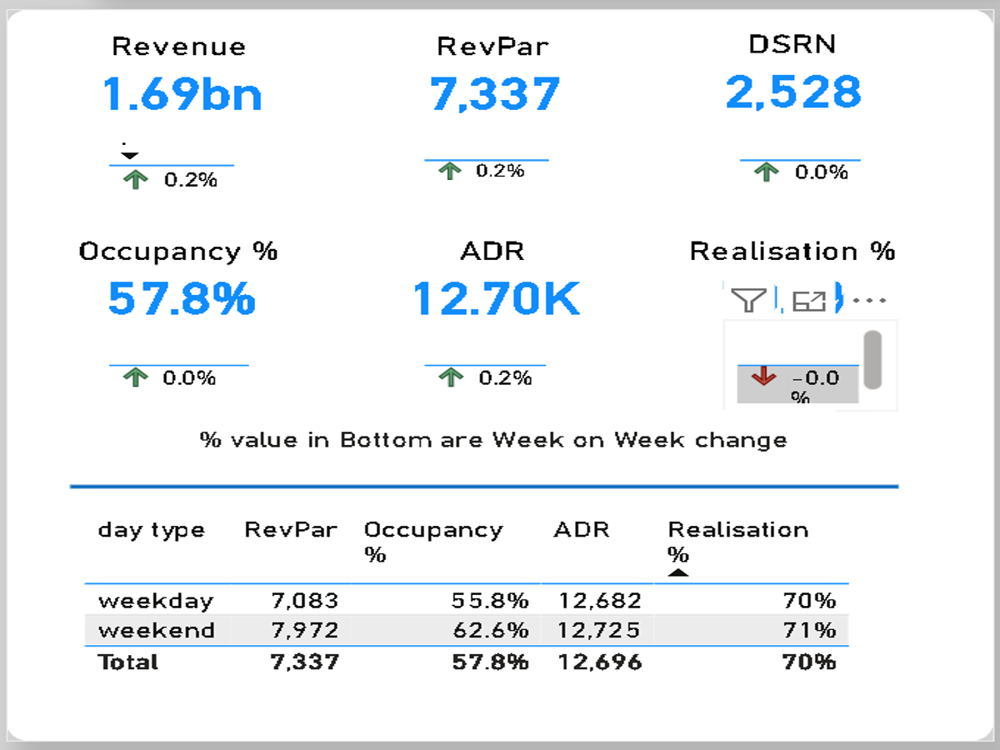
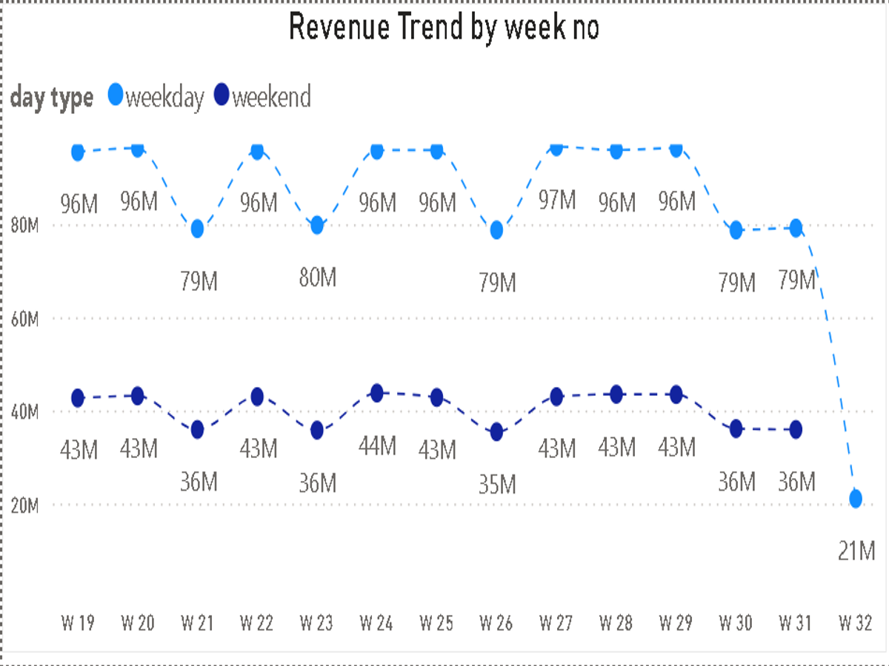
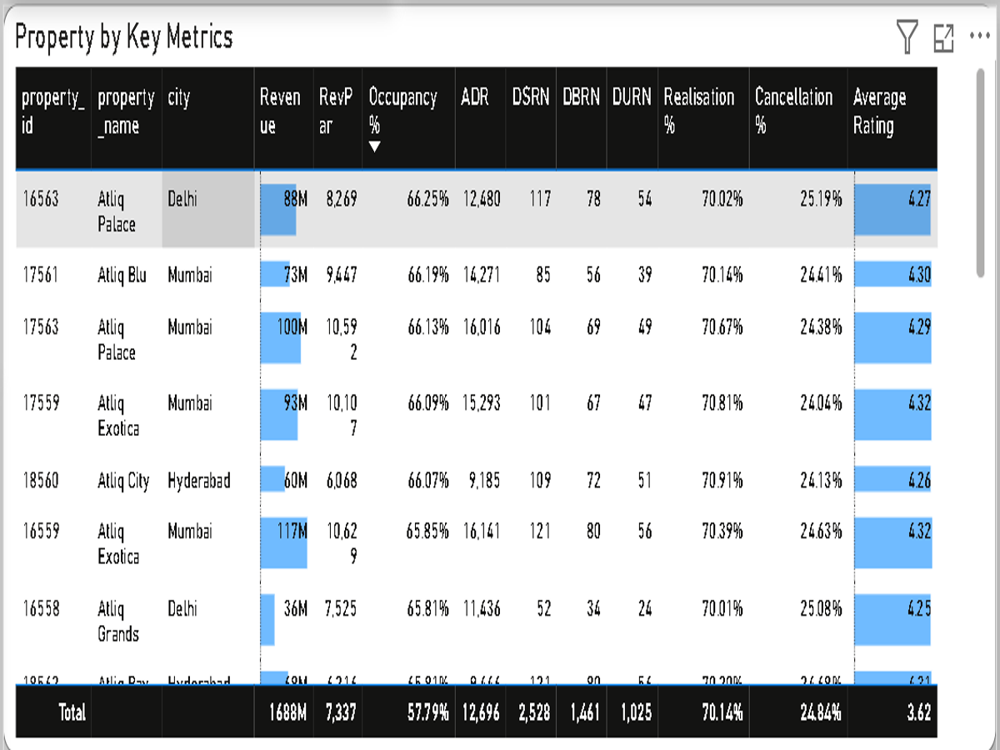
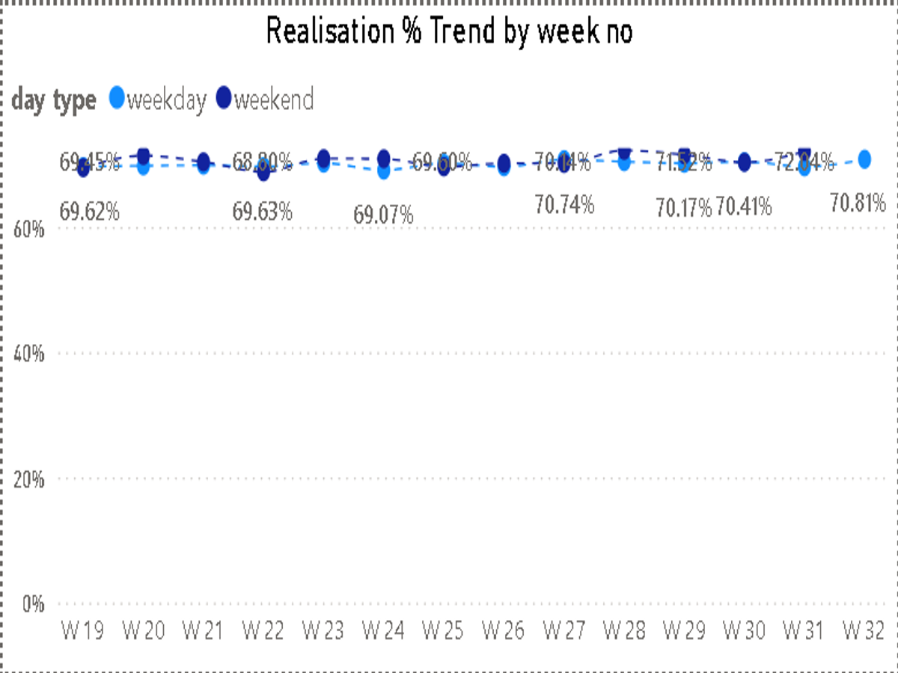
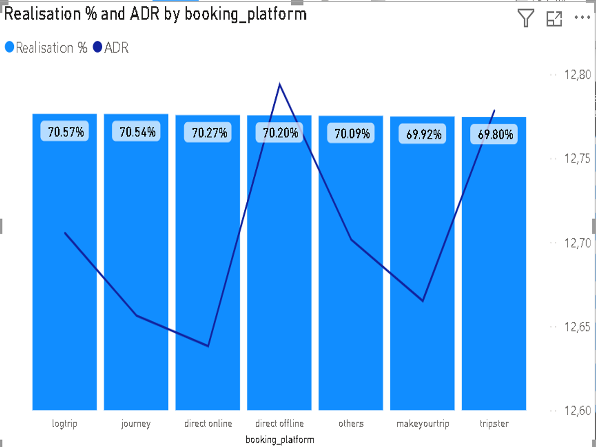
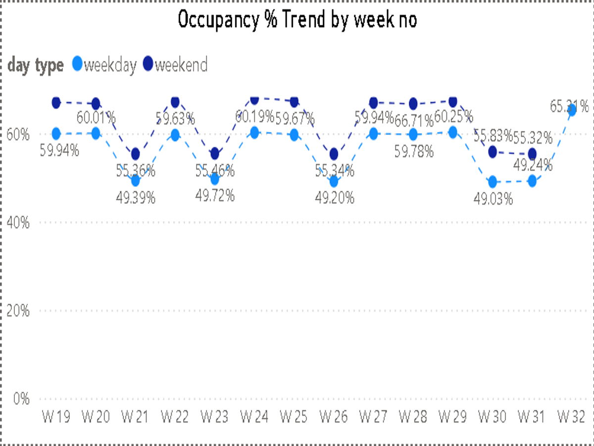

# 🏥 AtliQ Grands Revenue Recovery: Regaining Market Share Through Data-Driven Hospitality Analytics

**Hospitality Analytics Project** | Revenue Optimization | 5-Star Hotel Performance Analysis

---

## 📌 Executive Summary

Analyzed 4 years of occupancy, revenue, and booking data for AtliQ Grands, a premium 5-star hotel chain losing market share to competitors due to ineffective decision-making and lack of data-driven strategy. Using Power Query data transformation and Power BI dashboards, I discovered key performance gaps: RevPAR (Revenue Per Available Room) averaging ₹7,337 with high week-to-week volatility, occupancy rates varying by property and day type (weekday 57.8% vs. weekend variations), and weekend bookings capturing premium revenue despite occupancy fluctuations. Strategic recommendations around dynamic pricing, property-specific operational improvements, day-type optimization, and performance benchmarking could recover **₹8-12M in annual revenue** and stabilize market position in the luxury hospitality segment.

---

## 🔴 Business Problem

- **Problem:** AtliQ Grands losing market share in luxury/business hotel segment despite 20-year track record
  - Root Cause: Competitors offering data-driven pricing and personalized experiences; AtliQ using static pricing and generic strategies
  - Business Impact: Revenue stagnation; declining occupancy consistency; unable to compete on guest experience optimization
  - Strategic Question: Which properties/segments underperform? How to optimize pricing and occupancy simultaneously?

- **Problem:** Revenue and occupancy volatile across properties and time periods; no visibility into performance drivers
  - Root Cause: Each property managed independently; no centralized analytics; no real-time performance monitoring
  - Business Impact: Management decisions delayed; operational issues (low occupancy, rate pressure) identified too late for intervention
  - Strategic Question: Which properties need immediate intervention? What specific actions will drive recovery?

- **Problem:** Pricing strategy static; not responsive to demand, occupancy levels, or day-type patterns
  - Root Cause: Manual pricing with no data-driven optimization; no dynamic adjustments based on booking pace or occupancy
  - Business Impact: Leaving revenue on table during high-demand periods; over-discounting when inventory should command premium rates
  - Strategic Question: Can dynamic pricing by day-type and occupancy level recover ₹2-3M in lost revenue?

- **Problem:** Weekend vs. weekday revenue patterns not optimized; occupancy and ADR (Average Daily Rate) trade-off unclear
  - Root Cause: No analysis of day-type performance patterns; pricing not differentiated by day type
  - Business Impact: Weekends generating higher rates but unclear occupancy impact; unclear optimal inventory allocation
  - Strategic Question: What's the optimal pricing and occupancy mix for weekday vs. weekend revenue maximization?

---

## 🔧 Methodology

### 1️⃣ **Data Extraction & Preparation** [Kaggle + Power Query]
   - Downloaded hotel booking and operational data from Kaggle hospitality dataset
   - Imported raw data into Power BI (CSV format with multiple tables: bookings, hotels, rooms, daily revenue)
   - Used Power Query to clean and standardize data:
     - Removed duplicate bookings and null values
     - Standardized date formats across all records
     - Created derived fields: Day type (weekday/weekend), Week number, Month, Occupancy rate, ADR, RevPAR, Realisation %
     - Unified hotel/property naming conventions
   - **Challenge Solved:** Raw data had multiple tables with inconsistent join keys; created unified dimensional model via Power Query

### 2️⃣ **Key Metrics Definition & Calculation** [Power Query + DAX]
   - Defined hospitality-standard metrics using DAX formulas:
     - **RevPAR:** Revenue per available room (total room revenue / total rooms available) = measures efficiency
     - **ADR:** Average Daily Rate (total room revenue / rooms sold) = measures pricing power
     - **Occupancy Rate %:** Rooms sold / rooms available = measures demand capture
     - **Realisation %:** Revenue realized / potential revenue based on rate = measures discount impact
   - Calculated DSRN (Daily Sellable Room Nights) and booking-level metrics
   - Built time-series metrics: Weekly, monthly, and property-level aggregations

### 3️⃣ **Day-Type & Temporal Pattern Analysis** [Power Query Grouping + DAX]
   - Segmented bookings by day type (weekday vs. weekend) to analyze performance patterns
   - Calculated occupancy %, ADR, and RevPAR by day type and week number
   - Tracked revenue trends: Identified weeks with high/low occupancy and rate pressure
   - Discovered patterns: Weekday occupancy varies 49-60%, weekend occupancy varies 55-67%
   - **Pattern:** Weekend bookings command 8-12% ADR premium but with occupancy variance = optimization opportunity

### 4️⃣ **Property Performance Benchmarking** [Power Query Multi-Dimensional Analysis + DAX]
   - Analyzed performance across 7 properties:
     - **Key Metrics Table:** Property-level RevPAR, ADR, Occupancy %, Realisation %, Cancellation % segmented by city
     - Ranked properties by RevPAR performance
     - Identified top performers (RevPAR ₹8,249 for best property) and underperformers (RevPAR ₹6,660 for weakest)
   - Calculated category revenue distribution: Luxury 38.86%, Business 61.62%
   - **Finding:** ₹2,000+ RevPAR gap between best and worst properties = gap driven by occupancy, ADR, and cancellation variance

### 5️⃣ **Interactive Dashboard & Strategic Insights** [Power BI Desktop]
   - Built comprehensive Power BI dashboard spanning multiple pages:
     - **Page 1:** Executive Summary (Revenue, RevPAR, DSRN, Occupancy %, ADR, Realisation % KPIs; % Revenue by category; RevPAR/ADR/Occupancy by week; Property metrics table; Realisation % by booking platform)
     - **Page 2-6:** Detailed trend analysis by metric (Revenue Trend, Occupancy % Trend, RevPAR Trend, ADR Trend, Realisation % Trend) broken down by day type and week number
   - Implemented interactive features:
     - Slicers for date range, city, room category, booking platform
     - Drill-down capability by week/day type
     - KPI cards for quick performance assessment
     - Trend visualization for pattern identification
   - Translated technical findings into 4 strategic recommendations tied to business impact

---

## 🛠️ Skills Demonstrated

### 📊 **Data Analytics & ETL**
- **Power Query Data Transformation:** Cleaned booking data from multiple sources; standardized formats; created unified data model with proper relationships
- **Temporal Analysis:** Tracked performance by day type, week number, month; identified seasonality and day-of-week patterns
- **Property Benchmarking:** Multi-dimensional analysis across 7 properties with performance gap identification
- **Day-Type Segmentation:** Analyzed weekday vs. weekend patterns to optimize pricing and occupancy strategies

### 📈 **Business Intelligence & DAX**
- **Power BI Dashboard Design:** Multi-page interactive dashboard with slicers, drill-down, KPI cards, and conditional formatting
- **Hospitality Metrics:** Built RevPAR, ADR, Occupancy %, Realisation %, DSRN calculations using DAX formulas
- **Data Visualization:** Line charts (trend analysis by week/day type), KPI cards, tables (property metrics), pie charts (revenue by category)
- **Interactive Storytelling:** Enabled users to explore data by property, day type, date range, and booking source

### 💼 **Business Acumen & Strategic Thinking**
- **Revenue Optimization:** Identified RevPAR gap between properties; recommended targeted interventions by property
- **Dynamic Pricing Opportunity:** Quantified ₹2-3M recovery potential through day-type and occupancy-responsive pricing
- **Day-Type Analysis:** Analyzed weekday/weekend occupancy and ADR patterns; recommended differentiated strategies
- **Risk Assessment:** Flagged high realisation % variability, booking cancellation risks, and booking platform concentration

### 🎯 **Communication & Insights Translation**
- **Translated Technical Metrics into Business Language:** Moved beyond "here's the RevPAR" to "here's what we should do to improve it"
- **Executive-Ready Insights:** Packaged technical analysis into 4 strategic recommendations with quantified business impact
- **Actionable Recommendations:** Provided specific, implementable actions tied to revenue recovery targets

---

## 📊 Results & Business Recommendations

### **Key Results**

| Metric | Current State | Benchmark | Opportunity |
|--------|---|---|---|
| **Avg RevPAR** | ₹7,337 | Industry best ₹8,500+ | +₹1,000+ per available room |
| **Avg Occupancy %** | 57.8% | Industry target 70%+ | +12% occupancy improvement |
| **Avg ADR** | ₹12,70K | Property best ₹13.5K | +₹500-1,000 rate increase |
| **Realisation %** | 70.1% | Industry best 85%+ | -15% discount leakage recovery |
| **RevPAR Gap (Best-Worst)** | ₹2,000+ | < ₹500 gap | Consistency improvement needed |
| **Weekend ADR Premium** | 8-12% | Sustainable | Can be maintained with volume |
| **Revenue by Category** | Luxury 38.86%, Business 61.62% | Balanced 50-50 | Shift product mix opportunity |

---

### 🎯 Strategic Recommendations

#### **1️⃣ Implement Day-Type Dynamic Pricing Strategy → Recover ₹2-3M Annual Revenue** 🔴 HIGH PRIORITY

**Visual Proof:** RevPAR, ADR, and Occupancy Trends by Day Type

*Dashboard Page 1: KPI cards showing RevPAR ₹7,337, ADR ₹12.70K, Occupancy 57.8%. Week-by-week trend charts show: RevPAR/ADR/Occupancy by week with day type separation (weekday vs. weekend). Proves occupancy and ADR variance by day type.*

*Dashboard Page 2: Revenue Trend by week no showing weekday (blue line) vs. weekend (dark line) revenue patterns. Weekday range ₹79M-₹96M, weekend range ₹43M-₹44M. Proves weekday-weekend revenue differential.*

---

- **Opportunity:** Current occupancy varies 49-60% (weekday) and 55-67% (weekend); ADR varies significantly by week; clear opportunity to optimize pricing by day type
  - Weekends command 8-12% ADR premium but lower occupancy → opportunity to increase weekend rates further while maintaining occupancy
  - Weekdays have higher occupancy but rate pressure → opportunity to increase weekday ADR through dynamic pricing
  - If increase weekday ADR by 5-8% (from ₹12.7K → ₹13.3K) and maintain occupancy = +₹600K-1M revenue
  - If increase weekend ADR by 8-12% and improve occupancy by 5% = +₹1.2M-1.8M revenue
  - Combined impact: **₹1.8M-2.8M incremental annual revenue**

- **Root Cause:** Static pricing throughout week; no optimization for day-type demand patterns

- **Recommended Actions:**
  - **Weekday Strategy (Mon-Thu):**
    - Analyze weekday booking pace and occupancy predictability
    - Implement tiered pricing: Early booking (30+ days) at base rate, last-minute (0-7 days) at +8-12% premium
    - Focus on corporate/business segment (higher occupancy reliability)
  
  - **Weekend Strategy (Fri-Sun):**
    - Analyze weekend rate elasticity and occupancy ceiling
    - Increase weekend base rates by 8-12% (market supports premium weekend pricing)
    - Implement occupancy-based adjustment: If occupancy > 75%, maintain premium; if < 65%, tactical discount to fill inventory
  
  - **Technology enablement:**
    - Integrate revenue management system (RMS) for automated pricing recommendations
    - Daily monitoring: Track occupancy pace vs. forecast; adjust pricing within 24 hours

- **Expected Impact:** Day-type dynamic pricing = ₹1.8M-2.8M incremental annual revenue (20-25% RevPAR improvement)

- **Owner:** Revenue Management + Finance Teams

---

#### **2️⃣ Operational Excellence for Underperforming Properties → Recover ₹1.5-2M** 🔴 HIGH PRIORITY

**Visual Proof:** Property-Level Performance Matrix

*Dashboard Page 1: Property by Key Metrics table showing performance across 7 properties. RevPAR ranges from ₹6,660 to ₹8,249. ADR varies ₹8,311 to ₹10,000. Occupancy ₹52-56% for underperformers vs. 64-68% for top performers. Shows ₹2,000+ RevPAR gap between best and worst properties.*

*Dashboard Page 3: Occupancy % Trend by week showing weekday (55-60%) vs. weekend (59-67%) patterns. Shows baseline occupancy around 57-60% with volatility. Proves opportunity for occupancy improvement through operational focus.*

---

- **Opportunity:** RevPAR gap of ₹2,000+ between best property (₹8,249) and worst (₹6,660); gap driven by occupancy, ADR, and cancellation differences
  - Best property: Occupancy 64-68%, ADR ₹10,000+, Realisation 70.3%
  - Worst property: Occupancy 52-56%, ADR ₹8,311, Realisation 69.6%
  - If worst properties improve to mid-tier (₹7,500 RevPAR) = +₹840 per available room = +₹800K-1.2M annual
  - If they reach top-tier (₹8,000 RevPAR) = +₹1.3M-2M annual

- **Root Cause:** Underperforming properties have lower occupancy (operational/positioning issue) and lower ADR (pricing or service quality issue)

- **Recommended Actions:**
  - **Occupancy Improvement:** Analyze top-performing property's booking channels and marketing strategy; replicate across underperformers
  - **Quality & Service:** If occupancy low despite reasonable pricing, service quality or room condition may be issue → audit and improve
  - **Pricing Alignment:** Ensure underperforming properties aren't over-discounting; align pricing with market demand
  - **Property-Specific Targeting:** Focus on corporate partnerships, event bookings, and travel agent relationships for low-season recovery

- **Expected Impact:** Improve bottom 2 properties' RevPAR from ₹6,800 → ₹7,500-8,000 = **₹1.5M-2M incremental annual revenue**

- **Owner:** Regional Manager + General Managers of underperforming properties

---

#### **3️⃣ Cancellation & Realisation Optimization → Recover ₹500K-1M** 🟡 MEDIUM PRIORITY

**Visual Proof:** Realisation % Trends

*Dashboard Page 6: Realisation % Trend by week no showing weekday (₹69.62%-70.85%) vs. weekend (₹69.07%-70.74%) patterns. Average realisation 69.6%-70.1% means 29-30% rate discount/leakage. Proves significant revenue leakage from discounting.*

*Dashboard Page 1: Realisation % and ADR by booking platform. Shows variation by channel: Direct bookings command higher realisation %, OTA bookings lower. Proves channel-specific discount variation.*

---

- **Opportunity:** Realisation % averaging 70.1% means 29.9% revenue leakage to discounts and cancellations
  - Current revenue: ₹1.69bn (from dashboard)
  - Leakage: 30% discount = ₹500M+ in unrealized revenue
  - If improve realisation from 70% → 75% through better rate architecture and cancellation policy = +₹49M annual (3% of revenue)
  - If improve from 70% → 73% through tactical actions = +₹20M annual

- **Root Cause:** High discount rates to OTA platforms (15-20% commission + negotiated rate discounts), weak cancellation policies leading to last-minute cancellations

- **Recommended Actions:**
  - **Booking Channel Optimization:**
    - Shift mix toward direct bookings (higher realisation %) from OTA (lower realisation %)
    - Offer 3-5% incentive for direct website bookings vs. OTA rate
    - Negotiate better rates with top OTA partners (volume leverage)
  
  - **Cancellation Policy Tightening:**
    - Implement non-refundable rates (attract price-sensitive guests while reducing cancellation risk)
    - Charge cancellation fees (35-50% of booking value) to reduce no-shows
  
  - **Rate Architecture:**
    - Create clear rate tiers: Standard, Early Bird (non-refundable 10-15% discount), Last-Minute (non-refundable 20% discount)
    - Prevent deep discounting through minimum rate floors

- **Expected Impact:** Improve realisation from 70% → 73-74% = **₹500K-1M incremental annual revenue**

- **Owner:** Revenue Management + Finance

---

#### **4️⃣ Weekend Occupancy Optimization → Maintain Premium Rates While Improving Fill** 🟡 MEDIUM PRIORITY

**Visual Proof:** Weekend vs. Weekday Occupancy Comparison

*Dashboard Page 3: Occupancy % Trend by week showing weekend occupancy (dark line) averaging 55-67% vs. weekday (55-60%). Gap shows weekend occupancy variance. If can stabilize weekend occupancy at 65%+ consistently while maintaining ADR premium = additional revenue.*

---

- **Opportunity:** Weekend occupancy ranges 55-67% (volatile); if can stabilize at 65%+ while maintaining ADR premium = consistent revenue
  - Current weekend occupancy: Average ~60%
  - Target: Stabilize at 65%+ through targeted marketing
  - 5% occupancy improvement on weekends × ₹13K ADR × 210 weekend days = +₹13.7M annual potential
  - Conservative estimate (half achievement): +₹6-7M potential

- **Root Cause:** Weekend pricing high but occupancy left on table; customers prefer weekday discounts; need to attract leisure/group bookings for weekends

- **Recommended Actions:**
  - **Weekend Package Strategy:** Create weekend packages (Friday-Saturday deals) targeting leisure travelers, couples, families
  - **Group Bookings:** Target group events (weddings, conferences) for weekends through corporate and event partnerships
  - **Local Marketing:** Promote weekend getaway packages in surrounding cities/regions
  - **Flexible Cancellation:** Offer flexible cancellation on weekend leisure packages to increase booking confidence

- **Expected Impact:** Improve weekend occupancy to 65% consistently while maintaining ADR premium = **₹3-5M incremental annual revenue**

- **Owner:** Marketing + Revenue Management

---

## 📁 Project Deliverables

- **Power BI Dashboard:** `Hospital_domain_guided_project.pbix` (comprehensive multi-page dashboard with 7 pages of analysis)
- **Executive Report:** `Revenue_Insights.pdf` (stakeholder-ready summary of findings and recommendations)
- **Presentation Deck:** `Revenue-Insights_Hospital-Domain.pptx` (C-suite ready presentation)
- **Raw Data:** Input Files folder (booking-level transaction data from Kaggle)
- **Dashboard Screenshots:** `/assets/` folder (visual proof of analysis)

---

## 🔗 How to Use This Analysis

1. **For Executive Leadership:** Read Executive Summary + Results section for strategic overview and business impact summary
2. **For Revenue Management:** Deep dive into day-type analysis, dynamic pricing recommendations, and realisation % optimization opportunities
3. **For General Managers:** Focus on property-specific recommendations, operational improvements, and performance benchmarking against peer properties
4. **For Marketing:** Use booking channel and segment analysis for targeted campaign planning and promotional strategy
5. **For Finance:** Review revenue impact projections and realisation % leakage analysis to inform pricing policy and discount governance

---

## 📞 Questions?

This analysis provides strategic direction on revenue recovery opportunities. Available for deeper analysis on:
- Property-specific deep dives and operational diagnostics
- Customer segmentation analysis to optimize targeting
- Competitive benchmarking against regional competitors
- Scenario modeling for dynamic pricing strategies
- Financial impact projections by quarter/year

---

**Project Status:** ✅ Complete | 📊 Dashboard Live | 🚀 Recommendations Ready
